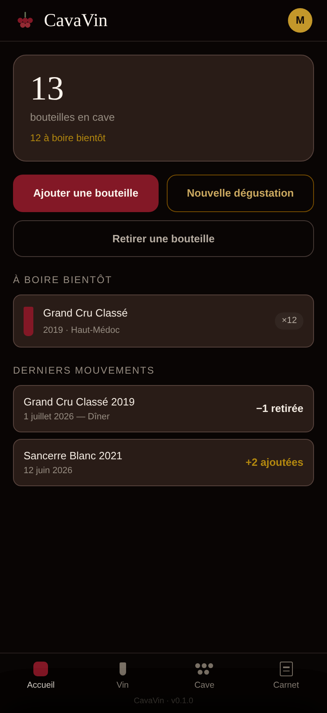
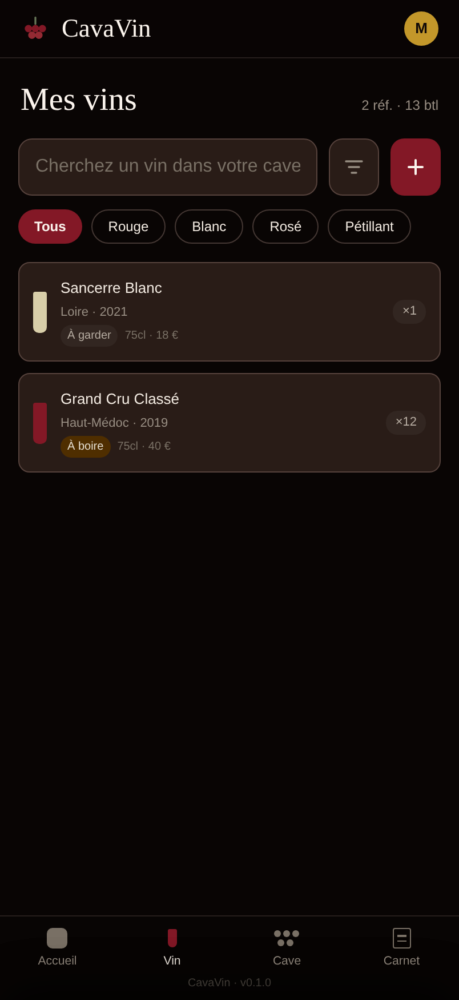
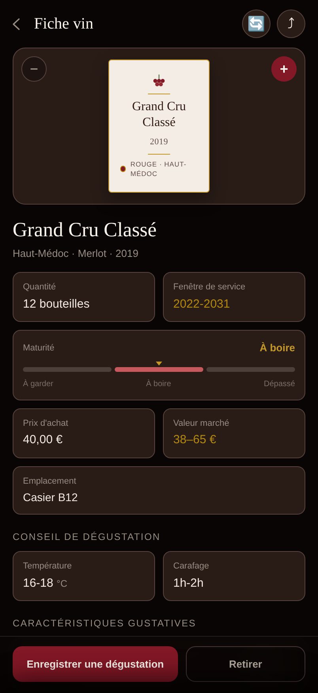
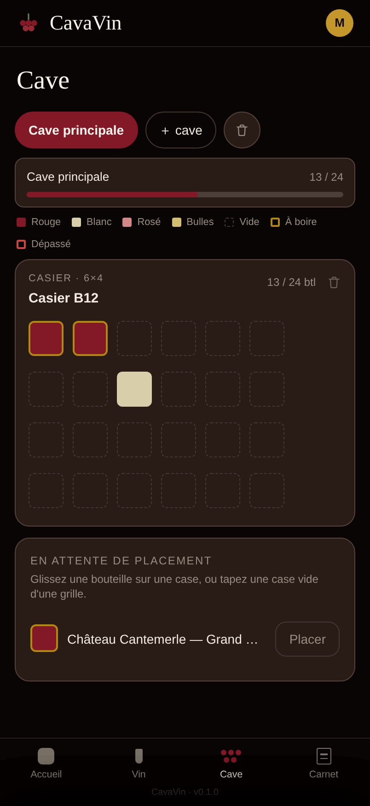

# CavaVin 🍷

**Cave à vin & assistant sommelier auto-hébergé.** Gérez votre cave, identifiez vos bouteilles
d'une photo d'étiquette, suivez leur fenêtre de dégustation et tenez votre carnet — le tout dans
un **conteneur Docker unique** (Django REST + SPA React, SQLite).

<p align="center">
  
  
  
  
</p>

## Fonctionnalités

- **Ajout par photo d'étiquette** (méthode par défaut), code-barres ou recherche par nom —
  identification en cascade : base locale → Open Food Facts (EAN) → **Claude (vision)** →
  wineapi.io → **OCR local + référentiel LWIN** (repli 100 % gratuit), avec mise en cache.
- **Fiche vin enrichie** : appellation, cépages, conseil de service (température, carafage),
  profil gustatif, accords mets-vins, prix marché et **historique de prix**.
- **Fenêtre de dégustation** calculée (à garder / à boire / dépassé) qui pilote un code couleur ;
  estimation affinée par le **cépage** (aptitude à la garde) et la **qualité du millésime** (repères
  régionaux), la saisie manuelle restant prioritaire.
- **Cave visuelle** : emplacements en arborescence (armoire → casier → clayette), placement des
  bouteilles case par case en glisser-déposer, jauge de remplissage.
- **Carnet de dégustation** privé (note /5, commentaire, profil).
- **Panneau d'administration** (staff) : tableau de bord du déploiement (comptes, catalogue
  mutualisé, stock, activité), état des sources d'enrichissement, gestion des comptes
  (activation, rôle staff, suppression), **paramétrage à chaud des clés d'API** (override en base,
  prioritaire sur le `.env`, sans redémarrage) et **import du référentiel LWIN** par upload de dump.
- **SPA mobile-first** (thème sombre lie-de-vin/or), authentification JWT à **session glissante**
  (le jeton de rafraîchissement tourne avec l'usage : pas de reconnexion périodique imposée).

## Stack

Django 6 + DRF · React 19 + Vite + Tailwind v4 · SQLite · Docker (mono-conteneur, Django sert le
SPA via WhiteNoise). Docs API : **Swagger** sur `/api/docs/`.

## Démarrage rapide (Docker)

```bash
cp .env.example .env      # renseignez au moins DJANGO_SECRET_KEY (et ANTHROPIC_API_KEY si dispo)
docker compose up         # tire ghcr.io/ppierre89/cavavin:latest — aucun build local
```

L'app est sur http://localhost:8000/. Le conteneur applique les migrations et sert les statiques
tout seul. Créez un compte : `docker compose exec app python manage.py createsuperuser` (ou via
l'écran d'inscription).

## Développement local

```bash
# Backend — Django sur :8000
cd backend && pip install -r requirements.txt
python manage.py migrate && python manage.py runserver

# Frontend — Vite sur :5173 (proxifie /api vers Django)
cd frontend && npm install && npm run dev
```

En production, un `Dockerfile` multi-stage build le SPA puis le fait servir par Django.
Voir [`frontend/README.md`](frontend/README.md) pour le détail du front.

## Architecture

```
CavaVin/
├── backend/
│   ├── config/            # settings, urls, auth JWT
│   └── apps/
│       ├── catalog/       # Domaine, Cepage, Cuvee — référentiel partagé
│       │   ├── enrichment/  # providers enfichables (OFF, Claude, wineapi.io, GrapeMinds, Vinou, LWIN/OCR local)
│       │   ├── apogee.py     # fenêtre/statut de dégustation (logique pure)
│       │   └── sommellerie.py # conseil de service (logique pure)
│       ├── cellars/       # Cave, Emplacement — structure physique (privé)
│       └── inventory/     # Bouteille, MouvementStock, NoteDegustation (privé)
├── frontend/              # SPA React + Vite + Tailwind
├── docker-compose.yml     # app tout-en-un (Django/gunicorn + SQLite)
└── .env.example
```

**Confidentialité (RGPD)** — les données sont cloisonnées en deux niveaux : un **référentiel vin
partagé** (catalogue mutualisé, lisible par tous) et des **données privées** (caves, bouteilles,
carnet) strictement filtrées par propriétaire côté serveur.

## API — points clés

| Endpoint | Rôle |
| --- | --- |
| `POST /api/auth/register/` · `token/` | Inscription / JWT (`Bearer`) |
| `POST /api/scan-etiquette/` · `scan-code-barres/` · `identifier-vin/` | Identification (photo / EAN / texte) |
| `GET /api/recherche-vins/?q=` | Recherche dynamique (autocomplétion) dans le référentiel LWIN |
| `GET /api/cuvees/{id}/fiche/` | Fiche vin consolidée (référentiel + conseil + enrichissement) |
| `POST /api/cuvees/{id}/rafraichir/` | Re-synchro wineapi (cooldown anti-quota) |
| `GET /api/bouteilles/` | Stock privé — chaque ligne porte les attributs de sa cuvée (couleur, appellation, région, valeur marché) et sa fenêtre d'apogée calculée |
| `POST /api/bouteilles/{id}/consommer/` | Sortie de stock atomique + journal |
| `/api/notes-degustation/` | Carnet de dégustation (privé) |
| `GET /api/auth/me/` | Profil du compte connecté (rôle `is_staff`) |
| `GET /api/admin-panel/apercu/` · `/api/admin-panel/utilisateurs/` | Panneau d'administration (staff) : aperçu + gestion des comptes |
| `/api/admin-panel/configuration/` · `import-lwin/` | Admin (staff) : clés d'API (override base > .env) + upload du dump LWIN |

L'identification est assurée en premier par **Claude (Anthropic)** : la vision multimodale lit
l'étiquette et la sortie, **contrainte par un schéma JSON**, remplit la fiche (couleur, appellation,
cépages, corps, acidité, description, accords) — sans jamais inventer prix ou notes. wineapi.io
reste en repli et apporte les données marchandes. Les clés se mettent dans `.env`
(`ANTHROPIC_API_KEY`, `WINEAPI_KEY`) ; chaque provider se désactive seul sans sa clé.

Un provider **GrapeMinds** (`api.grapeminds.eu`) est disponible en repli supplémentaire (recherche
texte, et analyse d'étiquette sur l'offre Enterprise). Il est **désactivé par défaut même avec une
clé** : il faut `GRAPEMINDS_ENABLED=True`, car ses conditions imposent une licence de stockage
persistant (PSL) payante pour conserver durablement ses données, et son quota public est serré
(~250 appels/mois). Cf. `.env.example` pour les variables `GRAPEMINDS_*`.

Un provider **Vinou** (`api.vinou.de`) apporte un catalogue producteur complémentaire (vins des
domaines inscrits sur Vinou, surtout allemands) : recherche par texte et par code-barres (`gtin`).
Authentification JWT (login `AuthID` + `API-Token`, jeton de 12 h mis en cache) ou mode public sans
identifiants. Également **désactivé par défaut** (`VINOU_ENABLED`) — couverture de niche. Cf.
`.env.example` pour les variables `VINOU_*`.

**Repli 100 % gratuit et hors-ligne** : sans aucune clé, le provider `lwin` prend le relais —
OCR **Tesseract** (binaire inclus dans l'image Docker) + correspondance floue (rapidfuzz,
orientée précision, pondération par rareté) sur le référentiel **LWIN** de Liv-ex
(~200 000 vins, dump gratuit sur <https://www.liv-ex.com/lwin/>). L'OCR localise l'étiquette
avant de la lire (esprit [WineNot](https://github.com/qanastek/WineNot), sans réseau de
neurones) : passes photo entière, correction d'orientation OSD (photos tournées sans EXIF),
puis recadrage sur la zone de texte relu en pleine résolution — une bouteille loin dans le
cadre ou une photo pivotée restent identifiables.

```bash
docker compose exec app python manage.py import_lwin /chemin/LWINdatabase.xlsx  # idempotent, ~1 min
```

Le même import est aussi disponible **par upload** depuis le panneau d'administration (section
« Référentiel LWIN »), sans accès shell au conteneur.

Le référentiel importé alimente aussi la **recherche dynamique** (`GET /api/recherche-vins/?q=`) :
suggestions au fil de la frappe (préfixes, tolérance aux fautes, millésime et couleur compris dans
la requête — « palmer rouge 199 »), branchées sur le champ de recherche de l'écran d'ajout ;
choisir une suggestion identifie le vin directement par son code LWIN, sans repasser par la cascade.
La saisie est **guidée par un score de similarité** : quand le meilleur candidat domine nettement
(`evaluation: sur`), l'appli propose directement sa fiche pré-remplie — domaine, cuvée, millésime,
région, et, si la cuvée est déjà au catalogue partagé, cépages, note de la communauté et accords
mets-vins ; quand l'algorithme hésite, la liste des correspondances sollicite une vérification
manuelle.

Toutes les sources activées étant de toute façon interrogées (fusion multi-sources), elles le sont
**en parallèle** : une identification coûte le temps de la source la plus lente, et non la somme de
toutes — l'attente est réseau, pas calcul. La photo d'étiquette est par ailleurs **réduite une seule
fois** avant l'envoi (grand côté 1568 px, seuil au-delà duquel les APIs de vision redimensionnent
d'elles-mêmes) : une photo de téléphone de ~9 Mo part en moins de 1 Mo, et toutes les sources
distantes se partagent cette version. L'OCR local, lui, garde l'original — sa phase de recadrage relit
la zone de texte en pleine résolution, ce qui rattrape une étiquette lointaine dans le cadre.

Tout hit est **mis en cache en base** ; les endpoints d'identification sont protégés par un
throttle et la re-synchro par un cooldown par vin. Détail complet dans Swagger.

### Mesurer la qualité de reconnaissance

Régler un seuil d'OCR ou de correspondance à l'aveugle, c'est risquer de dégrader la
reconnaissance en croyant l'améliorer. La commande `evaluer_reconnaissance` chiffre l'effet d'un
changement, en distinguant les trois issues possibles — la distinction est le cœur de la mesure :

- **reconnu** — le bon vin est identifié ;
- **silence** — aucune correspondance : l'utilisateur saisit à la main, c'est ennuyeux mais sans
  conséquence ;
- **erreur** — un *autre* vin est renvoyé. C'est l'issue coûteuse : elle contredit le parti pris
  « précision d'abord » et pollue le catalogue mutualisé, partagé par tous. Un réglage qui
  transforme du silence en reconnaissance est bon ; le même réglage qui transforme du silence en
  erreur est mauvais — et un simple « taux de réussite » confond les deux.

```bash
# Photos d'étiquettes réelles annotées (corpus livré avec le projet, images
# téléchargées à la demande) — mesure la chaîne complète, OCR compris.
python manage.py evaluer_reconnaissance --details

# Milliers de requêtes dérivées du référentiel LWIN avec un bruit d'OCR simulé
# (confusions de caractères, tokens perdus, mobilier d'étiquette). Reproductible
# via sa graine, sans photo ni clé d'API.
python manage.py evaluer_reconnaissance --synthetique 2000 --intensite 0.3

# Balayage du bruit : la courbe montre où la correspondance décroche.
for i in 0 0.3 0.6; do python manage.py evaluer_reconnaissance --synthetique 500 --intensite $i; done
```

Par défaut seule la source `lwin` est évaluée (gratuite et hors-ligne) ; `--sources toutes`
consomme les quotas des API. Le tiers synthétique exige le **dump LWIN importé** — sans lui, la
correspondance n'a rien contre quoi jouer et la commande le signale plutôt que d'afficher un 0 %
trompeur.

Deux corpus de photos sont fournis :

- **`etiquettes.json`** — 12 étiquettes issues du jeu [`LibreYOLO/wine-labels`](https://huggingface.co/datasets/LibreYOLO/wine-labels)
  (Roboflow-100, CC BY 4.0), annotées à la main. Ce jeu — comme tous ceux publiquement disponibles à
  ce jour — n'annote que **l'emplacement** des zones d'étiquette, jamais l'identité du vin : les
  annotations producteur/cuvée sont donc propres à CavaVin.
- **`openfoodfacts.json`** — régénérable à volonté, et à préférer pour une mesure sérieuse :

```bash
python manage.py corpus_openfoodfacts --nombre 300 --pays france
python manage.py evaluer_reconnaissance --corpus apps/catalog/evaluation_corpus/openfoodfacts.json --sources lwin
python manage.py evaluer_reconnaissance --corpus apps/catalog/evaluation_corpus/openfoodfacts.json --voie code-barres --sources lwin
```

Open Food Facts publie ses données en **ODbL** — l'extraction y est explicitement permise, à la
différence des sites marchands dont les CGU l'interdisent (le projet s'interdit déjà le scraping,
cf. les stubs Vivino et CellarTracker). Surtout, chaque produit porte son **code-barres** : la vérité
terrain est donc non ambiguë et obtenue sans annotation manuelle, ce qui permet des centaines de cas
au lieu de quelques dizaines, et l'évaluation des **deux** voies d'identification (`--voie image` et
`--voie code-barres`).

Deux limites à connaître avant de lire les chiffres :

- **N'évaluez pas la source `openfoodfacts` sur ce corpus** : il en est issu, le score serait de
  100 % par construction. La commande le refuse bruyamment. Le corpus sert d'arbitre indépendant
  pour les *autres* sources.
- Open Food Facts est **contributif**, donc parfois mal catégorisé — une confiture de clémentines y
  porte réellement le tag `en:wines`. Le générateur écarte les familles incompatibles (confitures,
  vinaigres, poissons…), mais quelques scories peuvent subsister : un écart peut venir du corpus
  autant que du moteur.

Le plus représentatif reste **vos propres photos de cave** (lumière, angle, reflets) : ajoutez-les au
manifeste de votre choix, le format est le même.

Un vin n'est identifié **qu'une fois** : les identités fortes d'un relevé (code-barres, référence
externe, code LWIN) sont toutes confrontées au catalogue avant d'envisager une création, et celles
qui manquaient à la cuvée retrouvée viennent la compléter. Scanner le code-barres d'un vin déjà
connu par son nom l'enrichit donc de ce code-barres : le scan suivant devient un **hit local**, sans
appel externe ni quota consommé. Un code-barres inconnu ne conclut pas (un même vin se décline en
plusieurs conditionnements) ; une référence externe ou un code LWIN inconnus, eux, désignent bien un
vin distinct.

## CI/CD

Trois workflows GitHub Actions sur chaque PR vers `main` et sur `main` :

- **`ci.yml`** — tests Django + couverture (seuil 85 %, ~92 % actuel), lint + build front, E2E
  Playwright (API mockée).
- **`release.yml`** — [semantic-release](https://semantic-release.gitbook.io/) : la version découle
  des **commits conventionnels** (`feat` → mineur, `fix`/`refactor` → patch, `BREAKING CHANGE` →
  majeur). Aucun numéro à gérer à la main.
- **`docker.yml`** — publie `ghcr.io/ppierre89/cavavin` (`latest` + tags semver) à chaque release.

## Déploiement NAS

L'image est publiée automatiquement ; le NAS n'a besoin que de `docker-compose.yml` + `.env`.

1. Dans `.env` : `DJANGO_SECRET_KEY` (valeur forte), `DJANGO_ALLOWED_HOSTS` (IP/nom du NAS),
   `ANTHROPIC_API_KEY` (recommandé — identification par photo via Claude), `WINEAPI_KEY`
   (optionnel). Sans clé, importez le dump LWIN (voir « API — points clés ») pour garder une
   identification gratuite.
2. `docker compose up -d` puis `docker compose exec app python manage.py createsuperuser`.
3. Accès : `http://<ip-du-nas>:8000/`. La base SQLite persiste dans le volume Docker `data`.

**Mises à jour** : `docker compose pull && docker compose up -d`.

> Sert du HTTP simple (accès LAN). Pour une exposition Internet, terminez le TLS via un reverse
> proxy et activez `SECURE_SSL_REDIRECT` / `*_COOKIE_SECURE` dans `settings.py`.

## Roadmap

- Recommandation mets-vins enrichie (LLM).
- Valorisation financière temps réel · partage de cave en lecture seule · mode hors-ligne.
